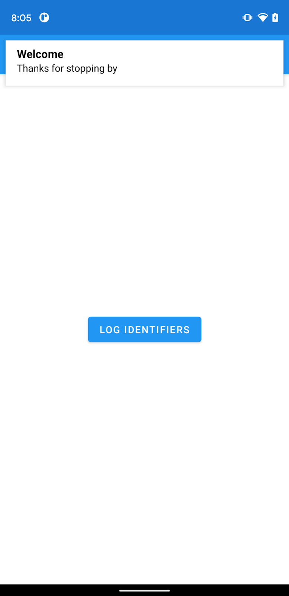
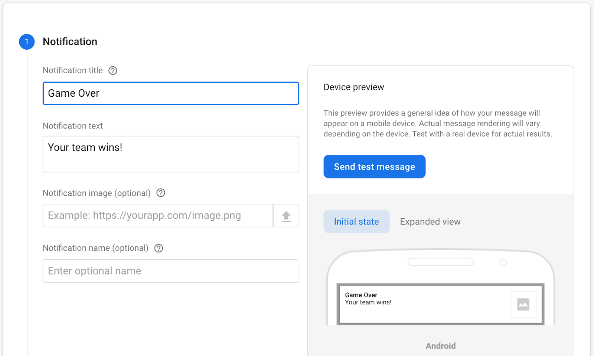
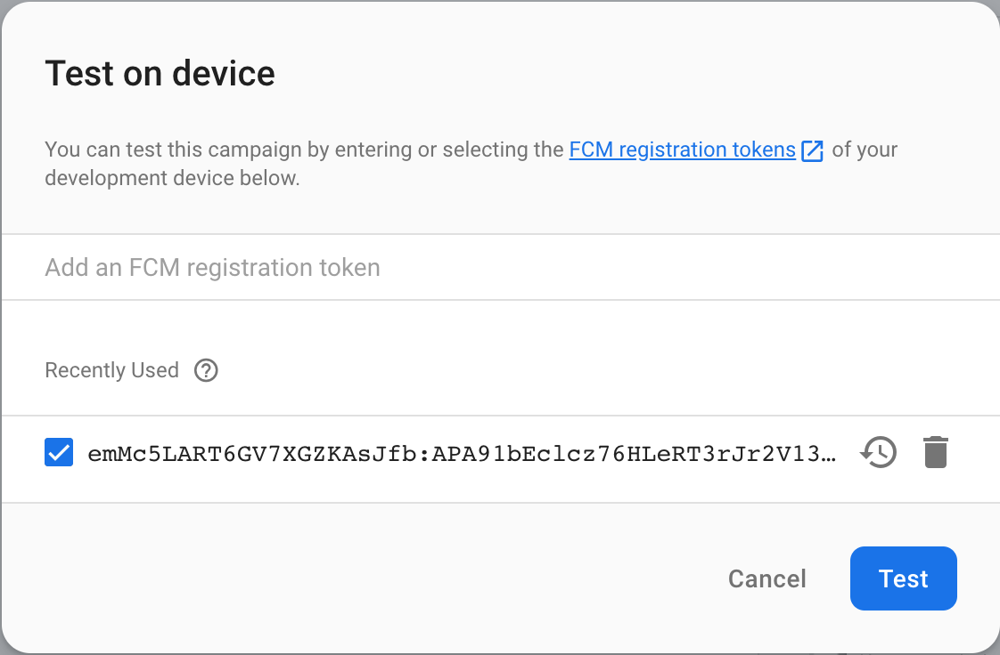
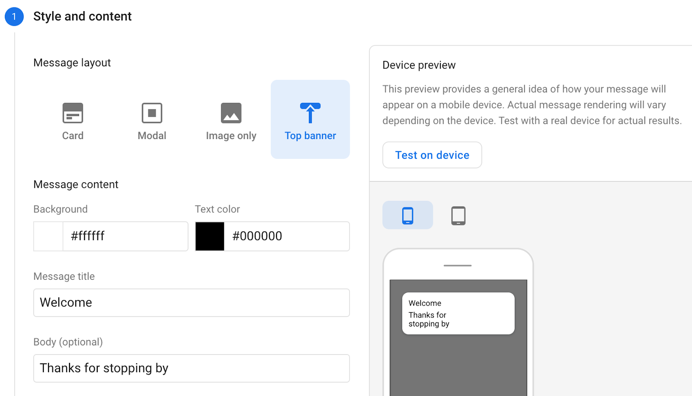
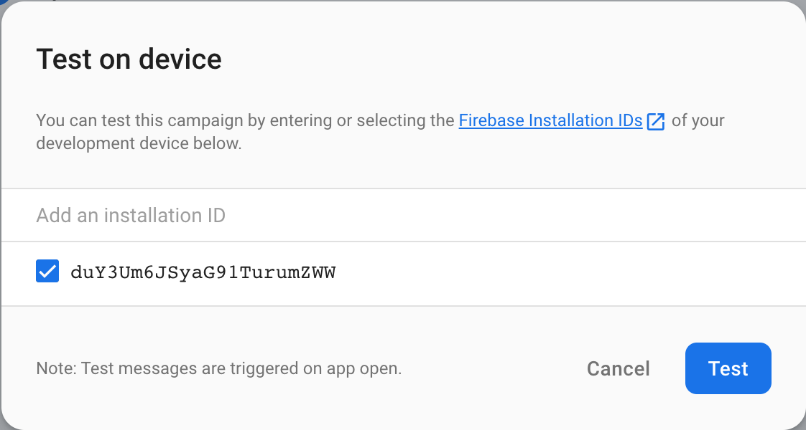

# Use FCM and FIAM to send messages to users

[Codelab Feedback](https://github.com/FirebaseExtended/codelab-fcm-and-fiam/issues)


## Before you begin


In this codelab, you learn how to add the ability to engage with users
whether they are using your app in the foreground or your app is in the
background.



### **Prerequisites**

None

### **What you'll learn**

* Add Firebase to your Android App
* Add FCM and FIAM dependencies
* Send test FCM message to your app
* Send test FIAM message to your app

### **What you'll need**

* Android Studio 4.1
* Android device or emulator


## Get started
Duration: 04:00


### **Get the sample code**

Clone the GitHub repository from the command line:

> aside positive
>
> $ git clone https://github.com/FirebaseExtended/codelab-fcm-and-fiam

### **Import the starter app**

From Android Studio, select the `codelab-fcm-and-fiam` directory ( ). It would be the one cloned in the previous step (**File** &gt; **Open** &gt; .../codelab-fcm-and-fiam).

You should now have the FcmAndFiam project open in Android Studio. If you see a warning about a google-services.json file missing, don't worry. It will be added in the next step.


## Create Firebase console project
Duration: 04:00


### **Add Firebase to the project**

1. Go to the  [Firebase console](https://console.firebase.google.com).
2. Select **Add project**.
3. Select or enter a Project name.
4. Follow the remaining setup steps in the Firebase console, then click **Create project**
   (or Add Firebase, if you're using an existing Google project).
5. From the overview screen of your new project, click the Android icon to launch the setup workflow.
6. Enter the codelab's package name: `com.google.firebase.codelab.fcmandfiam`

#### **Add google-services.json file to your app**

After adding the package name click **Register App then Download google-services.json** to obtain your Firebase Android config file then copy the google-services.json file into the *`app`* directory in your project. After the file is downloaded you can click **Skip** for the next steps shown in the console (they've already been done for you in the build-android-start project).

#### **Add google-services plugin to your app**

The google-services plugin uses the google-services.json file to configure your application to use Firebase. The google-services plugin dependency and the plugin itself should already be added to the project and app level build files respectively. Confirm the following entries:

build.gradle

```
buildscript {
  ...
  dependencies {
    ...
    classpath 'com.google.gms:google-services:4.3.4'
  }
}
```

app/build.gradle

```
plugins {
  ...
  id: 'com.google.gms.google-services'
}
```

#### **Add dependencies**

FCM and FIAM require the following dependencies. These dependencies should already be added to the app level build file. Confirm the following dependencies are added:

app/build.gradle

```
dependencies {
  ...
  implementation platform('com.google.firebase:firebase-bom:25.12.0')
  implementation 'com.google.firebase:firebase-analytics'
  implementation 'com.google.firebase:firebase-messaging'
  implementation 'com.google.firebase:firebase-inappmessaging-display'
}
```

#### **Sync your project with gradle files**

To be sure that all dependencies are available to your app, you should sync your project with gradle files at this point. Select **File &gt; Sync Project with Gradle Files** from the Android Studio toolbar.


## Log Identifiers
Duration: 01:00


Firebase Cloud Messaging and Firebase In App Messaging both use identifiers to send messages to apps. FCM uses a registration token and FIAM uses an installation ID.

1. In `MainActivity.kt` replace the TODO with the code below to log the identifiers needed to send messages:

```
FirebaseMessaging.getInstance().token.addOnCompleteListener { regTokenTask ->
   if (regTokenTask.isSuccessful) {
       Log.d(TAG, "FCM registration token: ${regTokenTask.result}")
   } else {
       Log.e(TAG, "Unable to retrieve registration token",
           regTokenTask.exception)
   }
}
FirebaseInstallations.getInstance().id.addOnCompleteListener { installationIdTask ->
   if (installationIdTask.isSuccessful) {
       Log.d(TAG, "Firebase Installations ID: ${installationIdTask.result}")
   } else {
       Log.e(TAG, "Unable to retrieve installations ID",
           installationIdTask.exception)
   }
}
```

2. Connect your Android device, and click **Run** ( )in the Android Studio toolbar.
   Tapping on the **Log Identifiers** button will log the FCM registration token and the Firebase Installations ID to logcat. The output should look like this:

```
D/FcmAndFiam: Firebase Installations ID: emMc5...AsJfb
  FCM registration token: emMc5LART6GV7...r0Q
```


## Send test FCM message
Duration: 02:00


FCM messages can be sent both from the Firebase console and from the FCM REST API. In this codelab we will compose an FCM notification message and send it to our device. Notification messages are those that are displayed in the system's notification area. Send a test FCM message by:

1. Ensure app is in the background (go to home screen)
2. Go to the Firebase console and select **Cloud Messaging** in the left navigation
3. Select **Send your first message**
4. Add a title and body for the message, then click **Send test message**



5. Add the FCM registration token, then click **test**



6. Observe display notification on device
7. Tapping on the notification opens the app


## Send test FIAM message
Duration: 02:00


Firebase In App Messaging can be triggered as a result of a variety of user events. The test message uses the app open event to trigger the In App Message. Send a test FIAM message by:

1. Ensure app is in the background (go to home screen)
2. Go to the Firebase console and select In-App Messaging in the left navigation
3. Select **Create your first campaign**
4. Select top banner campaign and enter title and body of the message
5. Click **Test on device**



6. Add Installations ID and click **Test**



7. Reopen app
8. Observe in app message


## Congratulations


Congratulations, you've successfully sent both FCM and FIAM messages. Now you
know how to engage with your users whether they are using your app in the
foreground or your app is in the background.

### **Further reading**

*  [Firebase Cloud Messaging docs](https://firebase.google.com/docs/cloud-messaging)
*  [Firebase In-App Messaging docs](https://firebase.google.com/docs/in-app-messaging)

### **What's Next**

* Send messages to users in your own Android app.

### **Reference docs**

*  [Firebase Cloud Messaging](https://firebase.google.com/docs/reference/kotlin/com/google/firebase/messaging/ktx/package-summary)
*  [Firebase In-App Messaging](https://firebase.google.com/docs/reference/kotlin/com/google/firebase/inappmessaging/display/package-summary)

